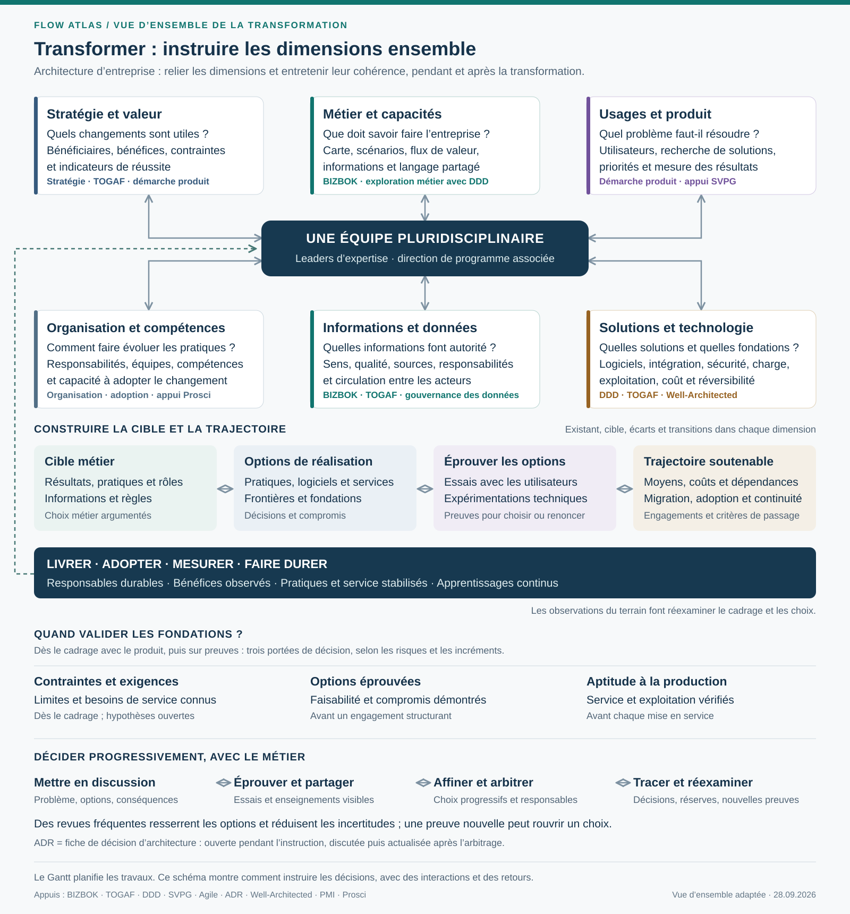
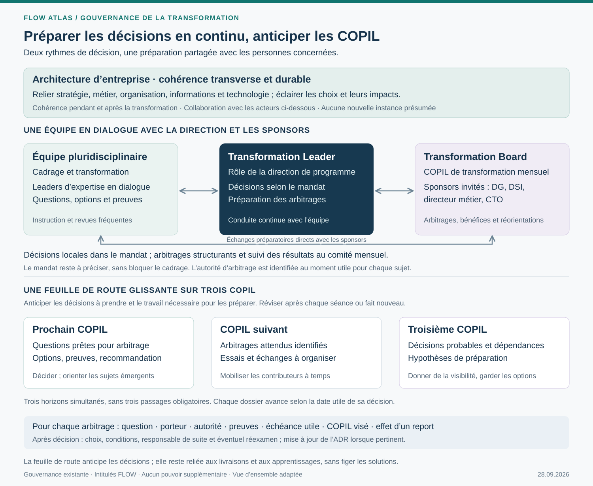

# Une méthode de transformation pour FLOW Atlas

Proposition de discussion — 28 septembre 2026 — U808, compléments U809 à U812 et U814–U815.

Laurent a validé le principe exposé après U807. Le parcours détaillé ci-dessous, ses points de décision et sa présentation restent proposés avant refonte. Aucun changement du modèle, des glossaires canoniques, de l’interface ou des publications n’est appliqué par ce document.

**Proposition : un cadrage partagé, six dimensions examinées conjointement et des décisions éprouvées par l’expérience.** La cartographie est une composante de l’architecture métier, utilisée pour relier les ambitions, les situations concrètes et les choix de transformation. La démarche produit et la technologie participent au cadrage dès l’origine.

Le schéma représente six dimensions qui se répondent : **ambitions et résultats ; métier et capacités ; usages et produit ; existant et écarts ; architecture des solutions ; fondations technologiques.** Les relations à double sens expriment leur contribution aux mêmes arbitrages. Elles ne signifient pas qu’il faut réunir tout le monde en permanence ou traiter chaque question avec la même profondeur.

**Un Gantt peut planifier les travaux et leurs dépendances ; il ne décrit pas à lui seul la manière d’instruire le problème.** Un besoin produit peut révéler une contrainte technique ; un essai technique peut ouvrir une autre solution ; une différence de sens métier peut faire revoir une frontière logicielle. Le cadrage reste vivant pendant la transformation.

Les cinq volets ci-dessous sont des **entrées de lecture, pas des étapes à terminer successivement**. On avance sur les questions liées avec une profondeur adaptée à l’incertitude et au risque. Des dépendances réelles et des points de décision subsistent : traiter conjointement les dimensions ne signifie pas tout construire en même temps.

## Une équipe qui cadre et décide progressivement

**Une équipe pluridisciplinaire porte un cadrage commun. Ses leaders d’expertise instruisent leurs sujets en collaboration continue et rendent leurs choix compréhensibles pour les autres.** Métier, produit, architecture, données, technologie, sécurité et exploitation contribuent selon les questions. Des investigations spécialisées restent nécessaires ; elles rejoignent les mêmes hypothèses, essais et arbitrages, sans attendre un dossier final.

La démarche agile proposée consiste à travailler par cycles courts sur les incertitudes prioritaires. Elle ne suppose pas d’adopter Scrum ni de produire du code à chaque revue de cadrage. L’avancement se mesure ici aux questions clarifiées, aux options éprouvées, aux risques réduits et aux décisions préparées ou prises. Cette adaptation au cadrage s’inspire de la collaboration régulière, du retour d’expérience et de l’attention à la conception du Manifeste Agile [R8] ; elle ne reprend pas son critère de logiciel opérationnel comme seul indicateur du cadrage.

À chaque cycle, l’équipe choisit une question qui engage plusieurs dimensions, construit une représentation concrète ou un essai, puis présente les résultats aux personnes concernées. Une revue utile expose : **ce qui a été appris, les options encore ouvertes, leurs conséquences, la décision attendue et la prochaine preuve à obtenir**. Son rythme dépend de la vitesse d’apprentissage et des décisions à préparer ; un rendez-vous hebdomadaire peut être un point de départ à éprouver, sans cadence imposée par cette proposition.

L’« entonnoir » décrit la convergence progressive d’une question : problème partagé → options explicites → preuves discutées → choix éclairé. Plusieurs questions avancent à des vitesses différentes. Une nouvelle preuve peut rouvrir une option ; la convergence ne consiste pas à faire accepter progressivement une solution prédéterminée.

### Des responsabilités de décision explicites

Pour chaque sujet, préciser qui instruit, qui contribue, qui décide et quand la décision devient nécessaire. Le leader technique engage son expertise sur la faisabilité et la qualité ; le produit et le métier éclairent usages et résultats ; les responsables concernés arbitrent les compromis transverses. La collaboration ne supprime ni les délégations ni la responsabilité du décideur.

Le métier participe aux conséquences sur le service, l’organisation, les engagements, le coût et les risques. Les détails techniques contenus dans un cadre déjà convenu peuvent rester délégués aux experts. Par exemple, **illustration sans cible FLOW adoptée** : avant de demander de choisir un mécanisme d’échange, discuter de l’actualité nécessaire d’une information, du comportement attendu en cas de panne et du délai acceptable de reprise. Les alternatives techniques deviennent alors comparables sur des besoins compris.

### Une gouvernance ancrée dans les instances existantes

**Existant décrit par Laurent en U812 :** la direction de programme travaille en lien continu avec l’équipe de cadrage et de transformation ; certaines décisions sont prises localement selon le mandat du programme ; un comité de pilotage de transformation (**COPIL**) se réunit chaque mois et invite les sponsors — DG, DSI, directeur métier et CTO — pour les décisions les plus structurantes. Les rôles nominatifs, seuils de délégation et règles de décision ne sont pas détaillés dans cette contribution.

### Transformation Leader et Transformation Board

En réponse à U815, je propose ces deux intitulés pour rendre lisibles les responsabilités de conduite et d’arbitrage déjà décrites. Leur portée vise les résultats métier, l’adoption et la cohérence de la transformation, autant que la réalisation du programme. Ce sont des conventions de présentation proposées pour FLOW, sans prétendre que TOGAF ou les autres références imposent ces noms.

| Intitulé proposé | Rapprochement avec l’existant U812 | Responsabilité proposée |
| --- | --- | --- |
| **Transformation Leader** — responsable de la transformation | Rôle de conduite porté par la direction de programme ; personne à identifier, sans nomination présumée. | Animer la collaboration, tenir ensemble résultats attendus, trajectoire, dépendances et adoption ; décider dans sa délégation ; préparer les arbitrages et suivre leurs effets. |
| **Transformation Board** — comité de pilotage de la transformation | COPIL de transformation mensuel déjà décrit, avec les sponsors invités. | Arbitrer les choix les plus structurants : orientations, priorités, engagements, ressources et risques ; examiner résultats et bénéfices, puis réorienter si nécessaire. L’autorité effective reste celle des personnes ou de l’instance habilitées. |

Le Transformation Leader travaille avec l’équipe et les leaders d’expertise en continu. Il prépare avec eux et avec l’architecture d’entreprise les décisions à venir, anime la feuille de route des COPIL et organise les suites des arbitrages. Le Transformation Board reçoit les questions mûries au fil des échanges ; ses séances peuvent aussi donner une orientation utile à un dossier encore en instruction.

L’architecture d’entreprise apporte la cohérence transverse et durable ; elle contribue aux deux rôles sans les remplacer. Les experts conservent leurs responsabilités de conception et de preuve. Aucun lien hiérarchique entre ces fonctions, pouvoir de présidence du Board ou rôle de sponsor du Leader n’est déduit de ces intitulés.

Ce rapprochement conserve les instances connues et explicite leurs contributions. Si le périmètre devait un jour couvrir plusieurs programmes, sa gouvernance pourrait être précisée à cette échelle ; cette extension n’est pas présumée ici.

**Proposition d’articulation : deux rythmes de décision, une préparation continue.** L’équipe et la direction de programme partagent les questions, les résultats des essais et les conséquences des options à mesure qu’ils apparaissent. Les décideurs habilités arbitrent dans leur mandat ; le COPIL traite les décisions structurantes préparées en amont. La direction de programme participe au travail de clarification et assure la cohérence des engagements, au-delà de la transmission des dossiers.

| Acteur ou instance | Contribution proposée | Décision et traçabilité |
| --- | --- | --- |
| **Équipe pluridisciplinaire et leaders d’expertise** | Instruire les questions, confronter les options, produire les preuves, proposer une recommandation et en expliquer les conséquences. | Prendre les décisions explicitement déléguées ; tracer les choix et signaler les sujets dépassant cette délégation. |
| **Direction de programme, en continu avec l’équipe** | Clarifier les priorités et les dépendances, préparer les arbitrages, mobiliser les sponsors concernés et tenir la feuille de route des décisions. | Arbitrer dans son mandat, faire instruire ou porter au COPIL les décisions qui le dépassent ; rendre explicites engagements et conditions. |
| **COPIL de transformation mensuel, avec les sponsors invités** | Examiner les décisions les plus structurantes et leurs conséquences à l’échelle de la transformation. | Décider, décider sous conditions, demander un complément ciblé ou différer explicitement avec une échéance. Consigner motif, conditions, responsable de suite et éventuel réexamen. |

Laurent précise en U814 que le mandat est encore peu clair et que cela n’empêche pas d’avancer sur la méthode. Sa formalisation complète n’est donc pas un préalable à cette proposition. Pour une décision effective, identifier simplement qui peut l’arbitrer au moment utile ; aucun droit individuel, unanimité ou quorum n’est supposé du seul fait de la présence d’un sponsor.

Le mandat pourrait expliciter les limites de délégation par **engagement financier, périmètre, résultat attendu, dépendances transverses, risque accepté et réversibilité**. Cette grille sert à orienter le sujet vers le bon niveau ; elle ne crée aucun seuil chiffré ni nouvelle délégation. Une décision techniquement détaillée peut avoir un impact majeur, tandis qu’un choix d’architecture encadré peut relever d’une délégation locale.

### Une feuille de route glissante des décisions en COPIL

L’architecture d’entreprise contribue à cette préparation par l’analyse des impacts et de la cohérence à l’échelle de l’entreprise, selon le rôle transverse proposé ci-dessous.

Je propose d’anticiper **les trois prochains COPIL**, horizon ajustable, puis de mettre à jour cette vue après chaque séance ou découverte qui change une décision. Son objectif est de rendre visible **ce qu’il faudra décider, pourquoi à cette date et ce qui doit être appris avant**. Elle reste distincte de la feuille de route des livraisons, à laquelle chaque décision peut être reliée.

Chaque ligne porterait : **question à trancher ; résultat ou engagement concerné ; porteur de l’instruction ; autorité de décision ; sponsors à associer ; options et recommandation ; preuves attendues ; date à laquelle la décision devient nécessaire ; COPIL visé ; conséquences d’un report ; état de préparation.** Une incertitude majeure ou une dépendance non résolue reste visible, même si une séance cible a été réservée.

| Horizon glissant proposé | Ce que l’on prépare | Ce que la séance permet |
| --- | --- | --- |
| **Prochain COPIL** | Questions mûres pour arbitrage, options comparées, recommandation et conséquences du choix ou du report. | Prendre les décisions nécessaires ; donner une orientation sur des questions moins mûres qui le nécessitent. |
| **COPIL suivant** | Alternatives à approfondir, critères de choix et essais à réaliser ; premiers échanges avec les sponsors concernés. | Réserver les arbitrages attendus et obtenir à temps les preuves nécessaires. |
| **Troisième COPIL** | Décisions probables liées aux engagements futurs et dépendances ; hypothèses de préparation. | Donner de la visibilité sur les prochains sujets sans figer leur solution ni promettre une décision prématurée. |

Ces colonnes représentent des horizons de préparation simultanés, pas trois phases obligatoires pour chaque dossier. Un sujet simple peut être arbitré immédiatement dans le mandat ; une décision complexe peut nécessiter plusieurs échanges avec le COPIL. Un dossier peut revenir pour une orientation, puis une décision, puis un réexamen sur des résultats nouveaux.

**La préparation associe les sponsors concernés avant la séance.** L’équipe expose assez tôt le problème, les choix possibles et les critères ; les revues suivantes apportent les preuves et précisent la recommandation. La direction de programme vérifie que la question et les conséquences sont comprises. Ces échanges préparent l’arbitrage sans présumer son issue ni remplacer l’accord explicite de l’instance habilitée.

Pour une décision donnée, le support de séance peut tenir sur une page : question, raison de décider maintenant, options, faits et incertitudes, recommandation, impacts et décision demandée. Les détails techniques et les ADR sont accessibles en appui. Après la séance, reporter la décision, ses conditions et ses suites dans les documents concernés, puis actualiser la feuille de route.

Si l’échéance utile précède le prochain COPIL et que la décision dépasse le mandat local, la direction de programme fait convenir d’un mode d’arbitrage anticipé avec l’autorité compétente. Cette possibilité est à organiser ; elle n’est pas décrite comme un dispositif déjà installé. La date du COPIL ne doit devenir ni une attente automatique ni un motif pour décider sans les preuves nécessaires.

**Bénéfice attendu :** connaître tôt les arbitrages à venir permet de concentrer les essais, de mobiliser les bonnes personnes et de lever les dépendances au moment utile. **Compromis :** maintenir une anticipation suffisamment précise pour préparer les décisions, tout en la révisant à partir des apprentissages. Cette articulation prolonge les appuis TOGAF sur la gouvernance [R2], Agile sur la collaboration [R8] et ADR sur les décisions réparties dans le temps [R9] ; ni le rythme mensuel fourni par Laurent ni l’horizon de trois séances proposé ne sont attribués à ces références.

### L’architecture d’entreprise : une cohérence entretenue dans la durée

**Je propose de présenter l’architecture d’entreprise comme une fonction transverse qui relie la stratégie, le métier, l’organisation, les informations et les choix technologiques, pour éclairer les décisions et maintenir leur cohérence dans la durée.** Elle contribue à la gouvernance par un travail continu de compréhension, de conception et d’analyse des impacts. Un organe dédié peut porter cette fonction ; sa forme d’organisation n’est pas arrêtée ici.

Ce positionnement rejoint l’appui TOGAF déjà consulté : méthode et gouvernance de l’architecture, alignement des dimensions métier, données, applications et technologie, puis gestion de leur évolution [R2]. La traduction en fonction transverse FLOW, avec l’organisation et la continuité après le programme, est notre proposition. Elle ne suppose pas qu’une instance d’architecture d’entreprise soit déjà installée.

| Contribution proposée | Pendant le cadrage et la transformation | Dans la durée, après le programme |
| --- | --- | --- |
| **Relier les ambitions aux changements** | Expliquer quelles capacités, pratiques, responsabilités, informations et solutions contribuent aux résultats recherchés. | Réexaminer ces liens quand la stratégie, les usages ou les contraintes évoluent. |
| **Maintenir une vue d’ensemble** | Faire apparaître les dépendances, incohérences et impacts entre domaines, produits et initiatives, au-delà du périmètre d’un seul projet. | Garder une représentation fiable de l’existant et des évolutions engagées ; éviter que les décisions locales rendent l’ensemble incohérent. |
| **Éclairer les options et les transitions** | Comparer les solutions, proposer des principes communs, examiner les étapes intermédiaires et expliciter les compromis. | Réexaminer les exceptions, la dette et les décisions devenues inadaptées ; préserver l’historique de leurs raisons. |
| **Préparer les arbitrages** | Apporter à la direction de programme et aux sponsors une lecture de la cohérence, des risques et des effets transverses des choix. | Accompagner les équipes pérennes et les instances de décision pour les nouveaux investissements et changements. |

L’architecture d’entreprise collabore avec les leaders métier, produit, données et technologie. Elle peut faire émerger des exigences communes et challenger les options ; les analyses et essais restent conduits avec les experts concernés. Son périmètre traverse les six dimensions du schéma. L’architecture des solutions en constitue un champ de collaboration, sans résumer l’architecture d’entreprise à la conception logicielle.

**Articulation proposée :** l’équipe pluridisciplinaire instruit les questions ; l’architecture d’entreprise apporte la cohérence à l’échelle de l’entreprise et dans le temps ; la direction de programme conduit les engagements et la trajectoire ; les autorités compétentes, dont le COPIL pour les décisions les plus structurantes, arbitrent. Ces contributions se recouvrent et se nourrissent. Aucun visa systématique, droit de veto ni nouvelle instance d’approbation n’est créé par cette proposition.

**Exemple illustratif :** une option produit peut répondre à un usage tout en changeant la responsabilité d’une information utilisée ailleurs. L’architecture d’entreprise aide à identifier les autres usages, les responsables et les dépendances ; l’équipe compare les options et les teste ; la direction de programme prépare les conséquences sur la trajectoire ; l’autorité concernée arbitre le compromis. Le raisonnement reste pertinent après la fin du programme, quand un autre produit fait évoluer la même information.

Le bénéfice recherché est la continuité entre décisions locales et cohérence d’ensemble. Le compromis est de maintenir cette vue transverse sans imposer une centralisation de tous les choix ni un modèle exhaustif avant chaque action. La fonction peut être portée par plusieurs personnes ; la responsabilité de son entretien après le programme devra être identifiée au moment utile, sans bloquer le cadrage.

### Les ADR accompagnent la décision

Une **ADR — Architecture Decision Record**, ou fiche de décision d’architecture, peut être ouverte à l’état proposé pendant l’instruction. Elle explicite le contexte et le choix envisagé, puis conserve la décision, son statut et ses conséquences. Le principe de décisions distribuées dans le temps et de documents courts est explicitement décrit par Michael Nygard [R9].

Pour FLOW, je propose d’y relier également les options examinées, les preuves, le décideur, les personnes consultées et les conditions de réexamen. Cette extension est locale. La discussion se fait au fil des revues ; la fiche est actualisée après l’arbitrage. Une décision remplacée reste traçable. Une ADR ne remplace ni l’échange avec le métier ni un accord explicite ; les décisions de valeur ou de priorité ne sont pas toutes des décisions d’architecture.

Le bilan de cadrage consolide ainsi **les décisions déjà préparées et prises, les réserves et les questions encore ouvertes**, avec la trajectoire correspondante. Il peut comporter un engagement final sur budget ou périmètre, sans faire découvrir à cette occasion l’ensemble des choix. La validation ne devrait pas être une séance de lecture collective d’une liste d’ADR inconnues.

## Volet 1 — Cadrer ensemble la transformation

Définir les résultats recherchés, les bénéficiaires, le périmètre et les contraintes. Associer métier, produit, architecture et technologie dès ce cadrage.

- **À établir :** problèmes à résoudre, situation de départ, indicateurs de résultat, contraintes de délai et de financement, exigences de sécurité et d’exploitation.
- **Technologie :** connaître les fondations existantes, les obligations d’entreprise, les limites et les possibilités utiles. Distinguer les contraintes établies des habitudes et des préférences.
- **Résultat :** un cadrage partagé et des hypothèses à vérifier. Une technologie disponible peut ouvrir une option ; elle ne démontre pas à elle seule l’intérêt du produit.

## Volet 2 — Décrire et comprendre le métier

Articuler plusieurs vues : la carte décrit les savoir-faire ; les scénarios montrent des situations ; les flux de valeur expliquent la progression vers un résultat utile ; les informations éclairent ce qui est connu, échangé ou décidé.

- **Cartographie FLOW :** Business System → Domain → Subdomain → Capability → Behavior, avec les règles actuelles de décomposition.
- **Vues transversales :** scénarios, parcours de mobilisation, informations et flux de valeur. Ces objets ne deviennent pas des niveaux supplémentaires de la carte.
- **Apport du DDD :** explorer le langage avec les experts et repérer les différences de sens. Cette exploration prépare la conception logicielle ; elle ne rebaptise pas les domaines FLOW en contextes logiciels.
- **Résultat :** un vocabulaire explicite, des frontières argumentées et des situations permettant d’éprouver la carte. Notre hiérarchie reste une convention FLOW, sans équivalence revendiquée avec BIZBOK.

## Volet 3 — Évaluer l’existant et les écarts

Examiner, pour les situations retenues, les pratiques, la couverture documentée des SI, les difficultés et les exigences non satisfaites. Confronter cette analyse aux résultats recherchés et aux premières hypothèses de cible ; les volets 3 et 4 s’alimentent mutuellement.

- **À distinguer :** capacité nécessaire, applicabilité à un contexte, couverture documentée et preuve de réalisation installée.
- **Technologie :** qualité et accessibilité des données, interfaces, performance, exploitabilité, dette et dépendances. Une inconnue est une question d’étude, pas une absence de couverture.
- **Résultat :** écarts qualifiés, impacts, preuves et priorités d’investigation. Sarenza reste non évalué sur les sujets dépourvus d’étude.

## Volet 4 — Construire la cible et la trajectoire : quatre travaux liés

| Travail | Question et contenu | Résultat attendu pour décider |
| --- | --- | --- |
| **4A. Cible métier** | Quels résultats et quelles responsabilités doivent évoluer ? Décrire capacités, informations, règles, scénarios et conséquences sur l’organisation ou les pratiques. | Une cible métier argumentée, avec bénéfices attendus, alternatives et frontières. |
| **4B. Architecture cible** | Comment réaliser cette cible ? Examiner ensemble informations et données, applications, intégrations, organisation, fondations et exigences de qualité. Le DDD stratégique aide à délimiter les modèles logiciels et leurs relations. Étudier ce qui sera conservé, configuré, acheté ou développé. | Des options d’architecture et des décisions explicites : critères, compromis, dépendances et conditions de réexamen. |
| **4C. Éprouver les options** | Le changement résout-il le problème ? La solution est-elle compréhensible, réalisable et exploitable ? Mener en parallèle des essais avec les utilisateurs et des expérimentations techniques ciblées. | Des preuves pour poursuivre, modifier ou abandonner une option. Un prototype utile ne démontre pas l’aptitude à la production. |
| **4D. Organiser la trajectoire** | Quels résultats livrer d’abord, avec quelles fondations et quelles transitions ? Ordonner les incréments, migrations, coexistences et retraits ; préciser financement, responsabilités et préparation des utilisateurs. | Une feuille de route par résultats, avec dépendances, critères de passage et capacité de révision. Un premier incrément doit être utilisable de bout en bout sur son périmètre. |

Ces travaux sont itératifs. Une expérience de 4C peut invalider une option de 4B ou faire préciser 4A. Une dépendance de 4D peut changer l’ordre de réalisation sans changer la finalité métier. Les décisions coûteuses à inverser demandent des preuves plus fortes et plus précoces.

La coordination proposée associe métier et produit pour les résultats et les usages, architectes et équipes techniques pour la cohérence et la faisabilité, sécurité et exploitation pour les exigences de service. Elle s’appuie sur la direction de programme en continu et sur le COPIL mensuel décrits en U812. La délégation exacte et l’autorité de décision par sujet restent à expliciter ; ce document ne constitue pas un organigramme de décision.

## Volet 5 — Livrer, adopter et mesurer

Construire et déployer par incréments, faire évoluer les pratiques, accompagner les utilisateurs et mesurer les résultats en service. La découverte de solutions et la réalisation se poursuivent en parallèle sur des sujets ou incréments différents.

- **Produit :** suivre usages et résultats, confronter les hypothèses aux observations, réviser les priorités.
- **DDD :** pour les développements qui le justifient, faire vivre le modèle dans le code ; choisir les objets, règles de cohérence et événements utiles. Les techniques détaillées du DDD ne sont pas un passage obligé pour toute configuration de progiciel.
- **Technologie :** vérifier le service rendu en conditions réelles, traiter incidents et dette, adapter les fondations à la charge et aux usages observés.
- **Résultat :** des bénéfices constatés et des décisions de poursuite, d’ajustement ou d’arrêt. La mise en production ne clôt pas la démarche.

## La démarche produit traverse le parcours

Elle commence au cadrage : identifier les utilisateurs, les problèmes importants et les résultats visés. Elle nourrit ensuite l’étude du métier et des écarts, les essais, la priorisation, la livraison et la mesure. Cette proposition s’appuie sur la distinction entre recherche de solutions et réalisation, ainsi que sur l’orientation vers les résultats décrites par SVPG [R4, R5].

Un produit peut être interne. Son périmètre se justifie par les utilisateurs et la valeur suivie dans la durée. Il peut mobiliser plusieurs capacités, applications ou contextes logiciels ; aucune correspondance un pour un n’est présumée. Des équipes de plateforme peuvent fournir des services partagés aux équipes produit, avec des besoins et des engagements explicites.

Le travail proposé relie un problème observé à un résultat mesurable, aux scénarios concernés, aux capacités mobilisées puis aux changements à réaliser. La carte aide ainsi à instruire un choix produit, sans devenir automatiquement la liste de ses fonctionnalités.

## Technologie : en parallèle du produit, avec trois points de décision

**On parle de technologie dès le cadrage. On valide les fondations nécessaires lorsque les usages, les exigences et les risques permettent une décision étayée, puis leur aptitude à la production avant chaque mise en service.** Une fondation critique peut nécessiter un travail préalable à plusieurs incréments ; cela doit apparaître dans la même trajectoire.

Les fondations désignent ici les moyens communs nécessaires au service : identité et accès, environnements, exécution, stockage, échanges, déploiement, supervision, sécurité et reprise. Leur périmètre dépend des usages et de l’existant ; il n’implique ni nouvelle plateforme complète ni fournisseur déterminé.

| Point de décision proposé | Quand ? | Ce qui est validé et sur quelles preuves |
| --- | --- | --- |
| **F1. Cadre de conception** | Dès 1, affiné en 2–3 | Contraintes justifiées, moyens réutilisables, objectifs de qualité mesurables et risques à explorer. Les hypothèses ouvertes restent visibles. |
| **F2. Options de fondation éprouvées** | En 4B–4C, avant un engagement important | Choix structurants étayés par une expérimentation représentative : intégration, droits, charge, reprise et coût selon les risques. Consigner les options écartées, limites et critères de réexamen. |
| **F3. Aptitude à la production** | En 5, avant chaque mise en service | Fondations nécessaires à cet incrément démontrées : exigences de sécurité et de service vérifiées, déploiement et retour arrière, supervision, exploitation et reprise. Les seuils sont convenus selon le contexte. |

F1 ne valide pas une pile technique définitive ; F2 ne vaut pas autorisation de mise en production ; F3 porte sur un périmètre et une charge identifiés. Les fondations partagées doivent aussi être éprouvées sur leurs contraintes transverses : réussir un petit cas pilote ne prouve pas leur aptitude à tous les usages.

Ce découpage F1–F3 est une recommandation FLOW, éclairée par TOGAF et par les pratiques de collaboration et d’expérimentation technique de Microsoft [R2, R7]. Il ne reproduit pas un processus normatif de ces références et ne choisit pas Azure.

## Place des références

| Référence | Appui proposé dans le parcours | Limite et adaptation FLOW |
| --- | --- | --- |
| **BIZBOK / Business Architecture Guild** [R1] | Structurer l’architecture métier et articuler capacités, valeur, informations et organisation ; principalement 2–4A. | Notre hiérarchie et nos comportements ne sont pas présentés comme une reproduction du guide. L’organisation éclaire la réalisation sans définir les capacités. |
| **TOGAF / The Open Group** [R2] | Organiser le travail d’architecture, ses décisions, les cibles et les transitions ; traverse le parcours. | Les cinq volets FLOW ne sont pas les phases officielles de l’ADM. TOGAF couvre aussi le métier ; il ne commence pas après BIZBOK. |
| **DDD / Eric Evans** [R3] | Explorer le langage dès 2 ; délimiter les modèles logiciels et leurs relations en 4B ; guider les développements concernés en 5. | Une capacité FLOW n’est pas automatiquement un contexte logiciel. Le DDD ne prescrit pas un microservice par domaine. |
| **Démarche produit / SVPG** [R4, R5] | Relier problèmes, résultats, essais, réalisation et apprentissage sur toute la durée. | Appui de pratique, sans adoption globale du modèle d’organisation SVPG. La démarche produit ne se réduit pas à la gestion d’une liste de travaux. |
| **ArchiMate / The Open Group** [R2] | Représenter les relations entre motivations, métier, solutions et changements lorsque cette formalisation aide la décision. | Langage complémentaire ; le SVG proposé n’est pas un diagramme conforme à sa notation. |
| **BPMN / OMG** [R6] | Décrire précisément un processus lorsqu’enchaînements, événements et responsabilités doivent être étudiés, notamment en 2 ou 4. | Une vue de processus ne remplace ni la carte des capacités ni un flux de valeur. Son usage reste ciblé. |
| **Well-Architected / Microsoft** [R7] | Éclairer la collaboration continue avec les équipes techniques et plateforme, ainsi que les essais de faisabilité. | Référence de pratique issue d’Azure, utilisée ici pour ses principes de travail. Elle ne prouve aucune réalisation installée ni couverture Dynamics. |
| **Manifeste Agile** [R8] | Organiser collaboration fréquente, apprentissage et adaptation pendant le cadrage. | Principes initialement formulés pour le développement logiciel ; leur application aux résultats du cadrage est une adaptation FLOW, sans cadre Scrum imposé. |
| **ADR / Michael Nygard** [R9] | Tracer les décisions significatives à mesure qu’elles sont instruites et prises. | La fiche n’est ni le processus de concertation ni une validation par elle-même ; les ajouts de preuves et responsabilités sont proposés pour FLOW. |

Le bénéfice de cette sélection est d’attribuer un rôle précis à chaque référence. Le compromis consiste à retenir un parcours FLOW simple tout en conservant les différences de sens et de portée ; nous ne prétendons pas fusionner ces cadres en un standard universel. Les références ERP Dynamics et SAP S/4HANA restent requises lors des comparaisons des fiches métier ; ce document compare des démarches, sans créer de telles fiches.

## Proposition de lecture dans Atlas

L’entrée **Méthodologie** ouvrirait sur le schéma des six dimensions autour du cadrage partagé, puis proposerait les cinq volets comme accès thématiques. Chaque volet présenterait sa question, les travaux utiles, les résultats attendus, les liens avec les autres volets et ses références. Le volet 4 donnerait accès aux quatre travaux détaillés. Produit et Technologie apparaîtraient parmi les dimensions du cadrage et dans les travaux qu’ils éclairent ; les repères DDD pointeraient vers les explications concernées. Aucun indicateur de progression linéaire ne laisserait croire qu’il faut clôturer un volet pour ouvrir le suivant.

La page d’entrée expliquerait d’abord le fonctionnement de l’équipe et la préparation progressive des décisions. Les dimensions du schéma seraient présentées comme des angles d’examen d’un même problème, jamais comme six équipes ou six livrables indépendants. Chaque volet reprendrait les questions à partager et les décisions qu’il aide à préparer.

Une lecture « Gouvernance et décisions » expliquerait le lien avec la direction de programme, le mandat de décision et les COPIL mensuels. Elle présenterait le principe de feuille de route glissante des décisions ; le présent lot ne crée ni calendrier opérationnel ni fonctionnalité de gestion de COPIL dans Atlas.

L’architecture d’entreprise y serait présentée comme une fonction transverse de cohérence, avec un repère couvrant stratégie, métier, organisation et technologie. Elle ne serait ni une sixième étape du parcours ni un niveau supplémentaire de la carte. Le guide expliquerait aussi sa continuité après la transformation. L’incertitude actuelle sur le mandat serait conservée comme contexte, sans faire de sa clarification complète une condition d’accès à la méthode.

Trois accès complémentaires resteraient distincts : **Métamodèle FLOW**, pour les objets et relations effectivement structurés ; **Glossaire méthodologique**, pour les notions nécessaires à toute la démarche ; **Références**, pour les appuis, adaptations et limites. Le glossaire métier conserverait son rôle propre.

Pour une première refonte, la proposition serait d’intégrer ce parcours pédagogique et de réutiliser les contenus existants de cartographie. Les volets encore à construire seraient signalés comme tels. Expliquer architecture logicielle, produit et technologie n’adopterait pas leurs objets dans le catalogue métier. Chaque publication conserverait son guide et ses définitions associés ; aucune lecture historique ne serait complétée depuis le backlog.

## Quelques termes employés

- **Architecture métier / Business Architecture :** description structurée du métier par plusieurs vues liées, dont ses capacités. La cartographie des capacités en constitue une partie.
- **Architecture d’entreprise / Enterprise Architecture :** dans cette proposition, fonction transverse reliant stratégie, métier, organisation, informations et technologie pour éclairer les décisions et entretenir leur cohérence pendant et après la transformation. Elle associe pratique d’architecture et contribution à la gouvernance ; elle ne désigne pas nécessairement une instance dédiée.
- **DDD / Domain-Driven Design :** approche de conception logicielle s’appuyant sur la compréhension et la modélisation du domaine avec ses experts [R3].
- **DDD stratégique :** travail sur les frontières des modèles et leurs relations ; **DDD tactique :** techniques détaillées pour réaliser ces modèles dans le logiciel. Ces termes ne créent aucun niveau dans la hiérarchie FLOW.
- **Bounded Context / contexte délimité :** périmètre dans lequel un modèle et son vocabulaire ont un sens cohérent. **Context Map :** représentation des relations entre ces contextes [R3].
- **Discovery / recherche de solutions :** travail visant à vérifier quelles réponses peuvent résoudre le problème ; **Delivery / réalisation :** construction, vérification et mise à disposition d’une solution utilisable [R5].
- **Incrément :** évolution livrée et utilisable sur un périmètre explicite. **Trajectoire :** ordre argumenté de changements et d’états intermédiaires.
- **Exigences de qualité :** niveaux attendus de sécurité, disponibilité, performance, exploitabilité ou coût, exprimés de façon vérifiable.
- **Fondations technologiques :** moyens communs nécessaires au fonctionnement et à l’exploitation des solutions, définis selon les usages.
- **ADR / Architecture Decision Record :** fiche courte conservant le contexte, le statut, le choix et les conséquences d’une décision d’architecture [R9].
- **COPIL / comité de pilotage de transformation :** instance mensuelle décrite par Laurent, qui invite les sponsors pour les décisions les plus structurantes. **Mandat :** périmètre d’autorité et conditions dans lesquels une personne ou une instance peut décider.
- **Transformation Leader :** intitulé proposé pour le rôle qui conduit la transformation avec l’équipe, prépare les arbitrages et suit leurs effets, dans le cadre de la direction de programme.
- **Transformation Board :** intitulé proposé pour le COPIL de transformation mensuel et son rôle d’arbitrage des décisions les plus structurantes. Il ne désigne pas une instance supplémentaire.
- **Sponsors cités par Laurent :** DG, direction générale ; DSI, direction des systèmes d’information ; directeur métier ; CTO, direction de la technologie. Leur autorité précise sur chaque décision reste à expliciter.
- **Feuille de route des décisions :** anticipation des arbitrages, de leurs échéances utiles et des travaux nécessaires pour les préparer ; distincte du calendrier des livraisons.

Ces explications servent la proposition. Elles ne créent pas d’entrées concurrentes dans les glossaires canoniques.

## Sources et périmètre de consultation

Consultées le **28 septembre 2026**. Synthèses locales et choix de parcours : Codex, proposition à discuter. Aucun rapprochement de cette section n’est qualifié d’équivalence normative.

- **R1 — Business Architecture Guild, [Domain 2: Core Mapping Knowledge](https://learning.businessarchitectureguild.org/products/domain-2-core-mapping-knowledge).** Page publique évolutive, sans édition affichée ; objectifs 2.1–2.4 et renvoi à BIZBOK partie 2, sections 2.2–2.5 effectivement lus. Appui sur les quatre disciplines de cartographie. Supports réservés aux inscrits non consultés ; les tentatives d’ouverture directe des PDF BIZBOK v8.5 et historique v13 ont renvoyé 403. Aucune lecture intégrale du guide revendiquée.
- **R2 — The Open Group, [How the ArchiMate Language and the TOGAF Standard Complement Each Other](https://help.opengroup.org/hc/en-us/articles/32115987894930-How-the-ArchiMate-Language-and-the-TOGAF-Standard-Complement-Each-Other).** Article mis à jour le 26 décembre 2025 ; sections 1–3 et tableau des phases ADM consultés. Appui sur les rôles de méthode, de gouvernance et de représentation, ainsi que sur la migration. Article explicatif, sans audit de conformité à une édition complète de TOGAF ou d’ArchiMate.
- **R3 — Eric Evans, [DDD Reference: Definitions and Pattern Summaries](https://www.domainlanguage.com/wp-content/uploads/2016/05/DDD_Reference_2015-03.pdf).** Mars 2015 ; sommaire et sections Bounded Context, Ubiquitous Language, Context Map, ainsi que distinction entre blocs de modélisation et conception stratégique consultés. Référence synthétique, sous CC BY 4.0 ; résumé sans reproduction des illustrations. Le placement dans les volets FLOW est notre proposition.
- **R4 — SVPG, [The Product Operating Model: An Introduction](https://www.svpg.com/the-product-operating-model-an-introduction/).** 10 février 2023 ; sections trois dimensions, stratégie, équipes, découverte et réalisation consultées. Appui sur résultats, problèmes et travail conjoint. Pratique d’un cabinet spécialisé, sans valeur de norme universelle ni transposition automatique à l’organisation FLOW.
- **R5 — Marty Cagan / SVPG, [Discovery vs. Delivery](https://www.svpg.com/discovery-vs-delivery/).** 22 octobre 2015 ; distinction entre apprentissage rapide et réalisation fiable, objectifs simultanés, expérimentation et passage à la production consultés. Appui pour la continuité de la démarche produit ; aucun modèle organisationnel imposé.
- **R6 — OMG, [Business Process Model and Notation 2.0.2](https://www.omg.org/spec/BPMN/2.0.2/About-BPMN).** Version 2.0.2, janvier 2014 ; page officielle de la spécification et références normatives consultées. Appui limité à l’identification du langage de processus ; aucune validation détaillée de notation BPMN réalisée dans ce lot.
- **R7 — Microsoft, [Collaborate with workload and platform teams](https://learn.microsoft.com/en-us/azure/well-architected/architect-role/collaboration).** Mise à jour du 15 avril 2026 ; collaboration continue, séquencement selon le risque, expérimentations et équipes de plateforme consultés. Appui de pratique technique ; cadre Azure dont aucune adoption fournisseur n’est déduite. Les repères F1–F3 sont propres à la proposition FLOW.
- **R8 — Auteurs du Manifeste Agile, [Principes sous-jacents au manifeste](https://agilemanifesto.org/iso/fr/principles.html).** Manifeste de 2001, traduction française publique ; principes de collaboration quotidienne, changements, conception et amélioration régulière consultés. Leur emploi pour un cadrage multidimensionnel est une adaptation méthodologique proposée.
- **R9 — Michael Nygard / Cognitect, [Documenting Architecture Decisions](https://www.cognitect.com/blog/2011/11/15/documenting-architecture-decisions).** 15 novembre 2011 ; sections Context, Decision et Consequences consultées. Appui sur décisions non simultanées, fiches courtes, statut proposé ou accepté et conservation des décisions remplacées. Les modalités de revue et les champs complémentaires FLOW sont des recommandations locales.

Sources locales : contributions U807–U812 et U814–U815, notamment U812 pour les instances existantes décrites par Laurent, U814 pour le rôle envisagé de l’architecture d’entreprise et U815 pour les intitulés de gouvernance proposés ; règles de hiérarchie et de vocabulaire dans `modeles/backlog/modeling-glossary.yaml` ; guide préparé `modeles/backlog/atlas-methodology-glossary-U806.yaml` ; conventions de modélisation et procédures de publication existantes. Les SVG expliquent la proposition ; ils ne deviennent pas une source de vérité concurrente du modèle.
